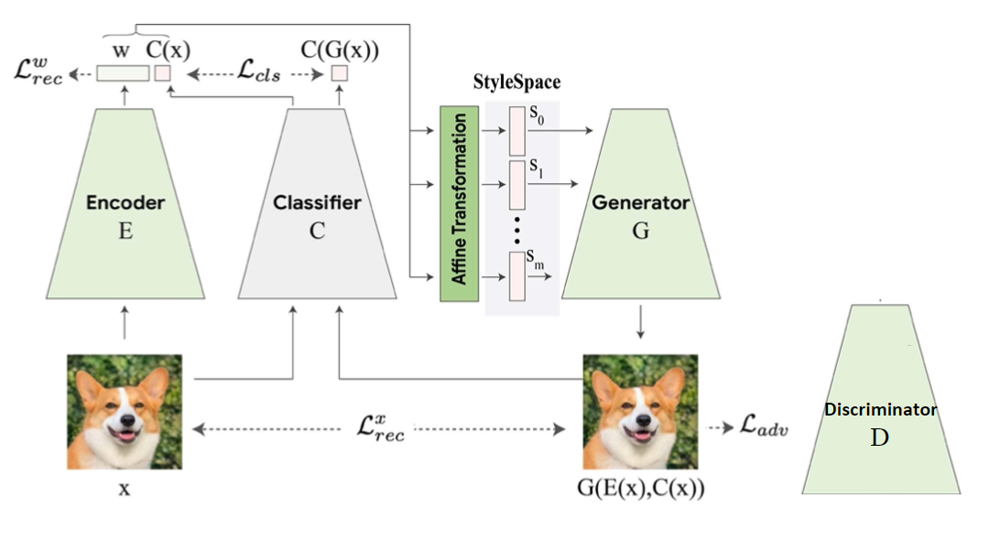

# Verwijder files train.job and classifier_train.py (als alles geupdate is) Add celebA classifier

# Reproducability study of the StylEx model
The code for the StylEx model in pytorch and further experiments based on the paper "Explaining in Style: Training a GAN to explain a classifier in StyleSpace" by Lang <i>et al.</i> (https://arxiv.org/abs/2104.13369).  
 
<figure>
   
  <figcaption> The StylEx architecture proposed by Lang <i>et al.</i> (slightly adapted image from https://arxiv.org/abs/2104.13369)</figcaption>
</figure>

The StylEx model is an adaptation of the StyleGAN2 model where we used the StyleGAN2 pytorch code from Rosanality (https://github.com/rosinality/stylegan2-pytorch). The model.py and the train.py python files are adaptations of this code.

### The Files: 
 -  <b>arialuni.ttf</b> contains the tfrecords for the fonts used in the notebook.
 -  <b> op </b> folder contains files from the Rosanality for the stylEx model. 
 - <b>classifier_model.pt</b> The pytorch classifier model, a mobilenetv2 model trained on the AFHQ dataset with image resolution of 64x64. (validation accuracy of 94%)
 - <b>env.yml</b> anaconda environment.
 - <b>factai.ipynb</b> is a notebook file where the AttFind algorithm is excecuted and the wu et al. results are replicated.
 - The <b>get_data.py</b> file consisits of the create_dataset_classes(img_folder, size, classes) and create_dataset(img_folder, size) functions to load and resize the images. 
 - The <b>model.py</b> contains all the general architectures of the stylEx model. Here you can find the Generator, the Discriminator and the Encoder. 
 - The <b>stylegan_normal_afhq.tfrecord</b> contains the tfrecords of the styleGAN2 model on the AFHQ dataset.
 - The <b>stylegan_stylex_afhq.tfrecord</b> contains the tfrecords of the stylEx model on the AFHQ dataset.
 - The <b>train.py</b> contains the training loop for the stylEx model. 

### Requirments:
To run the training code certain python libraries should be installed. When using anaconda the yml environment (env.yml) can be installed. For the notebook file the python library Ninja is needed. 

### How to train:
To run the training loop of the StylEx model one can run the command <code> python train.py --dir DATA_DIR </code> where DATA_DIR is the dircetory where the data is located. If the data is located in the the same file this part of the command can be excluded. Currently the FFHQ data is the expected together with the celeba classifier. When one wants to run the AFHQ they can uncomment the code above where the current code loads the data and change the celeba classifier to the AFHQ classifier.

### Common errors: 
- Due to torch version that can conflict with each other the following command can fix this: <code>  rm -rf /tmp/torch_extensions </code>
- Because we use the code from Rosanality (https://github.com/rosinality/stylegan2-pytorch) we can run into the same bugs, a common bug that can occur is that the code will cause the cache file to have an error. When this occurs the trainings code will not output anything and the entire setup will get stuck. To fix this problem one can either try the above command or go directly into the .cache/torch_extensions directory and delete the fused directory or any locked files that may appear there.

### User study:
A user study was also performed, the full csv of the results is included as well or else can be observed at https://docs.google.com/forms/d/1jx2hVrrzlDMBS6O_ZOUg_hUNVZ0Uw2_H4KLTF7p0NZ4/edit#responses. The original questions can be found in this google form: https://docs.google.com/forms/d/e/1FAIpQLSdaU9SHBva55oA5HaTz5lYEH4J0_q6ftZg6_4-6H8VeAAKHSQ/viewform.
